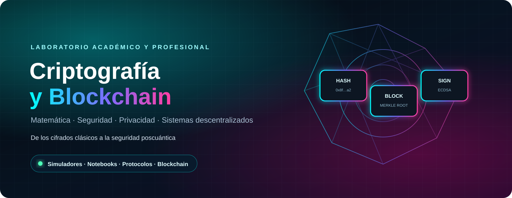

<div align="center">

<a href="https://sgevatschnaider.github.io/CriptografiayBlockchain/recursos/visualizaci%C3%B3n_%20art%C3%ADstica_julia.html">
  
</a>

<br>

[](https://sgevatschnaider.github.io/CriptografiayBlockchain/)
[](https://sgevatschnaider.github.io/CriptografiayBlockchain/simuladores/)
[](docs/criptografia/README.md)
[](docs/criptografia/guia-docente-simuladores.md)


</div>

Este repositorio es un **laboratorio académico y profesional** para estudiar cómo se construye la confianza digital. Integra fundamentos matemáticos, criptografía clásica y moderna, esteganografía, privacidad avanzada, blockchain, contratos inteligentes, seguridad poscuántica y criptografía cuántica.

> **Principio rector:** un algoritmo criptográfico no es seguro únicamente por su matemática. También importan el protocolo, la generación y custodia de claves, la implementación, el entorno de ejecución y el modelo de amenazas.

---

## 🧭 Acceso directo por módulos

Cada módulo posee una **página propia** que organiza su laboratorio integral, sus simulaciones especializadas, la teoría y los futuros notebooks o videos.

<div align="center">

[](https://sgevatschnaider.github.io/CriptografiayBlockchain/simuladores/modulo-01/)
[](https://sgevatschnaider.github.io/CriptografiayBlockchain/simuladores/modulo-02/)
[](https://sgevatschnaider.github.io/CriptografiayBlockchain/simuladores/modulo-03/)
[](https://sgevatschnaider.github.io/CriptografiayBlockchain/simuladores/modulo-04/)

[](https://sgevatschnaider.github.io/CriptografiayBlockchain/simuladores/modulo-05/)
[](https://sgevatschnaider.github.io/CriptografiayBlockchain/simuladores/modulo-06/)
[](https://sgevatschnaider.github.io/CriptografiayBlockchain/simuladores/modulo-07/)
[](https://sgevatschnaider.github.io/CriptografiayBlockchain/simuladores/modulo-08/)

</div>

### Área transversal

<div align="center">

[](https://sgevatschnaider.github.io/CriptografiayBlockchain/simuladores/fundamentos-matematicos/)
[](https://sgevatschnaider.github.io/CriptografiayBlockchain/simuladores/glosario-general.html)

</div>

### Laboratorios destacados

<div align="center">

[](https://sgevatschnaider.github.io/CriptografiayBlockchain/simuladores/01a-cifrado-cesar-castellano.html)
[](https://sgevatschnaider.github.io/CriptografiayBlockchain/simuladores/modulo-02/entropia-shannon.html)
[](https://sgevatschnaider.github.io/CriptografiayBlockchain/simuladores/modulo-03/modos-aes-aead.html)
[](https://sgevatschnaider.github.io/CriptografiayBlockchain/simuladores/05-blockchain.html)

</div>

---

## 🔬 Criterio de diseño de los laboratorios

Cada simulación combina cinco capas:

1. **Concepto:** qué objetivo de seguridad se estudia.
2. **Experimento:** variables que el usuario puede modificar.
3. **Métricas:** resultados numéricos y evidencia observable.
4. **Ataque o límite:** supuesto que debilita o rompe el mecanismo.
5. **Transferencia:** relación con protocolos y sistemas reales.

La interfaz común incorpora diseño responsivo, navegación por teclado, regiones de estado accesibles, manejo visible de errores y detección de disponibilidad de Web Crypto.

### Alcance de seguridad

- Los cifrados históricos, grupos pequeños y protocolos simplificados son **modelos educativos**.
- SHA-256, PBKDF2, AES-GCM y ECDSA se ejecutan mediante la **Web Cryptography API**.
- Web Crypto requiere HTTPS o localhost, condición satisfecha por GitHub Pages.
- Los ejemplos no reemplazan bibliotecas auditadas, parámetros vigentes ni una evaluación profesional de seguridad.

---

## 🗺️ Hoja de ruta

| Etapa | Núcleo conceptual | Contenidos principales | Resultado esperado |
|---|---|---|---|
| **1** | Criptografía clásica | Sustitución, transposición, César, Vigenère y criptoanálisis | Entender la relación entre diseño y ataque |
| **2** | Fundamentos de la criptografía moderna | Shannon, secreto perfecto, juegos de seguridad, complejidad, grupos, cuerpos, curvas y retículos | Razonar con definiciones, adversarios, costos y supuestos explícitos |
| **Base transversal** | Fundamentos matemáticos | Aritmética modular, grupos, cuerpos finitos, probabilidad y teoría de números | Dominar el lenguaje matemático de la criptografía |
| **3** | Criptografía moderna aplicada | AES, ChaCha20, hashes, MAC, RSA, DH, ECC, firmas y PKI | Diferenciar primitivas y combinarlas correctamente |
| **4** | Esteganografía | LSB, imágenes, audio, canales encubiertos y estegoanálisis | Separar ocultamiento de existencia y cifrado de contenido |
| **5** | Blockchain | Hashes, Merkle trees, firmas, wallets, consenso, contratos y DeFi | Comprender qué aporta realmente la criptografía a una blockchain |
| **6** | Protocolos y privacidad | PKI, commitments, secret sharing, ZKP, MPC y cifrado homomórfico | Analizar seguridad a nivel de protocolo |
| **7** | Poscuántica y cuántica | Shor, Grover, ML-KEM, ML-DSA, SLH-DSA, migración y QKD | Diseñar una estrategia de transición criptográfica |
| **8** | Seguridad aplicada | Gestión de claves, HSM, side channels, nonces, CSPRNG y threat modeling | Evitar fallas de implementación y operación |

<div align="center">

[](docs/criptografia/README.md)
[](docs/criptografia/plan-desarrollo-simuladores.md)
[](simuladores/catalogo.json)

</div>

---

## 🎨 Visualizaciones experimentales

<div align="center">

[](https://sgevatschnaider.github.io/CriptografiayBlockchain/recursos/visualizaci%C3%B3n_%20art%C3%ADstica_julia.html)
[](https://sgevatschnaider.github.io/CriptografiayBlockchain/recursos/hipercubo_criptografico.html)
[](https://sgevatschnaider.github.io/CriptografiayBlockchain/recursos/ataque_%20y_%20defensa.html)
[](https://sgevatschnaider.github.io/CriptografiayBlockchain/recursos/visualizacion_%20artistica_polinomio%20.html)
[](https://sgevatschnaider.github.io/CriptografiayBlockchain/recursos/cryptocube.html)
[](https://sgevatschnaider.github.io/CriptografiayBlockchain/recursos/spectral-graph-visualizer.html)
[](https://sgevatschnaider.github.io/CriptografiayBlockchain/recursos/protocolo_fiat_shamir.html)

</div>

---

## 🚀 Uso local

```bash
git clone https://github.com/sgevatschnaider/CriptografiayBlockchain.git
cd CriptografiayBlockchain
python -m http.server 8000
```

Luego abrí `http://localhost:8000/`.

Para los proyectos de blockchain y contratos inteligentes:

```bash
npm install
npx hardhat test
```

---

## ✅ Validación y publicación

El workflow [`.github/workflows/pages.yml`](.github/workflows/pages.yml):

- valida la existencia de los ocho laboratorios;
- revisa sintaxis JavaScript y enlaces locales;
- detecta identificadores HTML duplicados y utilidades no importadas;
- publica automáticamente el repositorio en GitHub Pages al actualizar `main`.

---

## 📂 Arquitectura principal

```text
.
├── assets/
│   └── readme-hero.svg
├── index.html
├── simuladores/
│   ├── index.html
│   ├── catalogo.json
│   ├── 01-criptografia-clasica.html
│   ├── 02-fundamentos-matematicos.html
│   ├── 03-criptografia-moderna.html
│   ├── fundamentos-matematicos/
│   ├── modulo-01/ ... modulo-08/
│   └── assets/
├── docs/criptografia/
├── recursos/
├── scripts/
├── tests/
└── .github/workflows/pages.yml
```

---

## 📄 Licencia

Este proyecto se distribuye bajo la licencia indicada en el repositorio.
